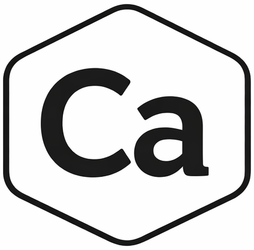

<p align="center">
  
</p>

# Calcium

> **Note:** This project is currently under active development. APIs and syntax may change without notice.

**A functional programming language with pipelines, pattern matching, and effect handling**

```calcium
use core.io!;

[1, 2, 3, 4, 5]
    |> filter(x => x % 2 == 1)
    |> map(x => x * x)
    |> reduce((a, b) => a + b, 0)
    !> io.println;  // 35
```

## Features

- **Pipeline Operator** (`|>`) - Chain function calls in a readable left-to-right style
- **Effect Pipeline** (`!>`) - Chain side-effecting functions with automatic result wrapping
- **Pattern Matching** - Powerful `match` expressions for control flow
- **First-class Functions** - Lambda expressions
- **Constraints** - Define and enforce value validation rules
- **Result Types** - Built-in `success(value)` and `failure(error)` for error handling
- **Module System** - External module support via Boneyard registry

## Quick Start

### Installation

```bash
# Clone the repository
git clone https://github.com/ytnobody/calcium-lang.git
cd calcium-lang

# Build
go build -o calcium ./cmd/calcium
go build -o bone ./cmd/bone

# Add to PATH (optional)
export PATH=$PATH:$(pwd)
```

### Hello World

```calcium
use core.io!;

"Hello, Calcium!" !> io.println;
```

```bash
calcium hello.ca
```

## Documentation

- [Getting Started](docs/getting-started.html) - Installation and your first program
- [Tutorial](docs/tutorial/) - Learn the language step by step
- [Modules](docs/modules/) - Using bone and Boneyard
- [Reference](docs/reference/) - Language specification and standard library

## Links

- [GitHub Repository](https://github.com/ytnobody/calcium-lang)
- [Boneyard Registry](https://github.com/ytnobody/boneyard)
